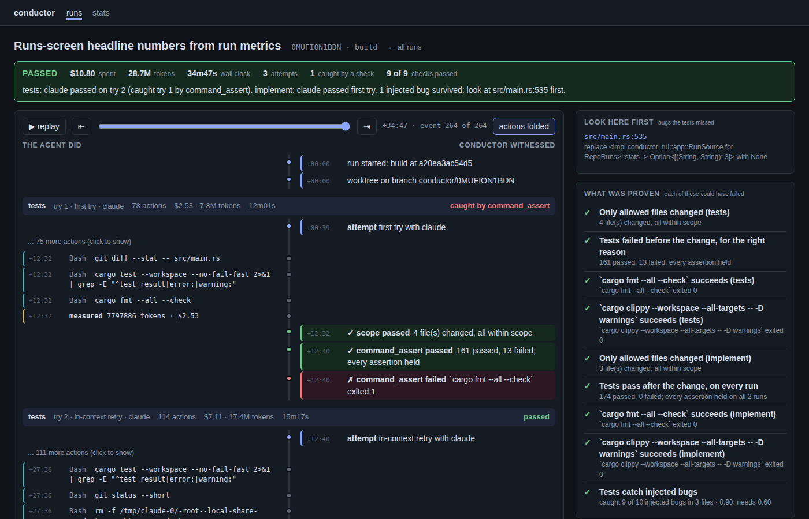
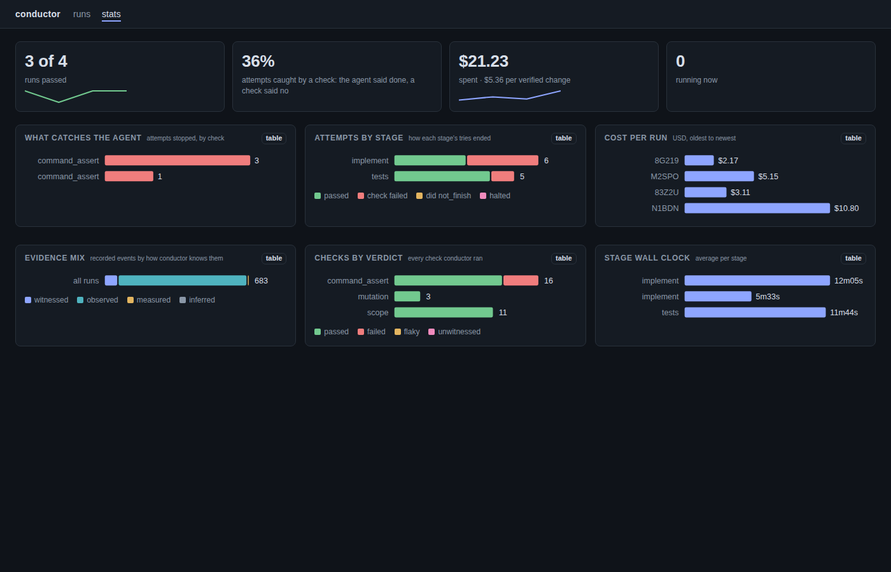

# conductor

Agentic software work with receipts. Conductor runs coding agents from YAML workflows,
in [herdr](https://github.com/ogulcancelik/herdr) panes when you want to watch, or headless
in CI and overnight. It checks their work with checks the agents can't touch. Every run ends
in a receipt that says what was proven, by which check, and what was not checked.

**Status: v0.1.** It runs build workflows on any project whose tests can write JUnit XML
(pytest, jest, vitest, go via gotestsum, Maven, Gradle, and most others), and reads
`cargo test` directly. Agents are `claude`.

## Try it

```bash
cargo install --path .
cd your-project
conductor init        # a starter workflow for your stack, prompts, policy and task file
$EDITOR .conductor/task.md
git add .conductor .gitignore && git commit -m "conductor"
conductor doctor      # is everything a run needs here?
conductor run .conductor/workflows/build.yaml --spec .conductor/task.md
```

The starter workflow has two stages. One agent writes failing tests for the task. A second
agent makes them pass without being able to touch them. On Rust, conductor then checks that
the tests catch bugs it injects into the change (mutation testing for other languages is
not wired up yet).

### Other languages

The test checks read JUnit XML, so nothing about them is language-specific. `init` detects
Rust, JavaScript (vitest, jest), Python (pytest), Go, Maven and Gradle, and otherwise
writes a starter to fill in. A check names where its report goes one of two ways:

```yaml
# conductor gives the command a fresh file outside the repository
- { type: command_assert, command: ["pytest", "--junitxml={{report}}"], parser: junit_xml,
    assert: ["tests_failed == 0", "tests_run > 0"] }
# or reads the runner's own report files, deleting old ones first
- { type: command_assert, command: ["mvn", "test"], parser: junit_xml,
    report: "**/target/surefire-reports/TEST-*.xml", assert: ["tests_failed == 0"] }
```

Runs happen in a fresh git checkout, so a workflow's `setup:` installs what a checkout
doesn't carry, once per run: `setup: [["npm", "ci"]]`. What setup writes must be ignored by
git (`node_modules/`), or the run halts rather than count it as an agent's change.

## See a run

```bash
conductor serve --open
```



Every run is two lanes. The left one is what the agent did: each file it wrote, each
command it ran, the tokens it spent. The right one is what conductor witnessed between:
every check and its verdict, every retry, every halt. The agent never grades its own work,
and here you can see who said what. The colour of an entry's edge is its evidence grade:
witnessed by conductor, observed from the agent, measured, or only inferred.

A run in progress updates as it happens. A finished one can be replayed event by event,
and each attempt's diff is a click away, so a reviewer reads "try 1 wrote this, the check
said no, try 2 changed these lines" instead of a final diff with no history.



The stats page is the lead's view: what stops agents, how each stage's tries end, cost
per run and per verified change, and how much of the record is witnessed rather than
observed or inferred. Everything is read from `.conductor/runs/`; the server writes
nothing and listens on localhost.

## A person in the loop, and evidence where the reviewer looks

A stage can be a person. The run pauses until they decide, from the evidence, and their
decision is the stage's check on the receipt:

```yaml
  - id: fix
    agent: { kind: claude }
    evidence: { to: "{{spec}}", files: ["logs/app.log"] }   # into the ticket, as it happens
    gates:
      - { type: command_assert, command: ["./scripts/deploy-and-test.sh"], parser: exit }
  - id: review
    agent: { kind: human, who: PO }
    prompt_file: .conductor/prompts/review.md            # what they are asked to decide
```

`evidence` appends every check's command, verdict and output, plus the files named, to
the ticket the run was given (`--spec tickets/BUG-101.md`), while the stage runs, so there
is nothing to collect afterwards. The decision lands there too. Decide from the run's
page in `conductor serve`, with `y` / `n` in `conductor ui`, or with
`conductor approve <run> --by PO -m "…"` and `conductor reject`.

What the agent does is on the record as it happens, so a person watching can tell working
from stuck. A tool the agent asks for that is outside `allowed_tools` is put to a person:
the stage's `who`, else whoever started the run. The question shows the moment it is asked,
on the run's page, in `conductor ui` (`y` / `n`), and for `conductor allow <run>` /
`conductor deny <run> -m "…"`. The agent waits, and the stage clock stops with it; the
answer and the time spent waiting are on the record. Nobody answering within a day is a
deny in nobody's name.

`examples/sdlc-mock/` is a Spring Boot service with one real bug, a ticket, a local
deploy and a log: the team's loop, small enough to run end to end in a minute. Its README
says what it can and cannot prove.

## Commands

| Command | What it does |
|---|---|
| `init`, `doctor` | Set up a repository, and check it and this machine are ready |
| `run <workflow> --spec <file>` | Run a workflow in its own worktree and branch; in herdr, each run gets a tab with a live status pane and a pane per stage |
| `receipt [<run>]` | Print a run's receipt |
| `verify <run>` | Re-check a run's record with no model calls |
| `deliver [<run>]` | Push a passed run's branch with its record and open a draft pull request with its receipt |
| `check-pr` | In CI: check that a pull request's branch ends at a delivered run's receipt, from git alone |
| `trace [<run>]`, `stats` | A run's timeline; what a repository's runs add up to |
| `ui` | The terminal UI, including runs in progress (`--demo` for sample data) |
| `approve`, `reject` | Decide a `human` stage the run is waiting on |
| `serve` | The same runs in a browser: two lanes, replay, live, receipts, stats |
| `pane …` | For agents inside a run: open, drive and close panes in the run's own tab |

## Delivering runs as pull requests

Add `deliver: { base: main }` to a workflow and every passed run becomes a draft pull
request. Or run `conductor deliver <run>` yourself. A token comes from `GITHUB_TOKEN`,
`GH_TOKEN` or `gh auth login`. Without one, conductor pushes the branch and writes the PR
body to the run's `pr.md`.

The branch's last commit holds the run's record. To have CI confirm that the receipt still
describes the code under review:

```yaml
# .github/workflows/receipt.yml
on: pull_request
jobs:
  receipt:
    if: startsWith(github.head_ref, 'conductor/')
    runs-on: ubuntu-latest
    steps:
      - uses: actions/checkout@v4
        with: { fetch-depth: 0 }      # check-pr reads the branch's history
      - run: cargo install --locked --git https://github.com/ashark-ai-05/conductor conductor
      - run: conductor check-pr       # fails if anything was committed after the receipt
```

## Telemetry

Set `CONDUCTOR_OTLP_ENDPOINT` (or `OTEL_EXPORTER_OTLP_ENDPOINT`) and each finished run is
sent to that collector as OTLP traces, logs and metrics. Commands and paths agents used are
cut to their first word unless `CONDUCTOR_OTLP_CONTENT=1`. `conductor trace` and
`conductor stats` work without a collector.

## How it fits together

- **A receipt may only say "passed" about a check that could have failed.** Checks run in
  conductor's own process, from the commit the run started at.
- **Evidence is labelled by where it came from.** It is `witnessed` (conductor ran it),
  `observed` (the agent's own log), `measured` (token usage) or `inferred` (herdr's view of
  an agent, used only for scheduling).
- **The record is hash-chained and anchored in a commit trailer.** `verify` and `check-pr`
  re-check it.

## Layout

| Path | What |
|---|---|
| `crates/conductor-model` | Workflows and validation, the evidence chain, receipts, UI view models |
| `crates/conductor-checks` | Checks: scope, command assertions over test results (cargo, JUnit XML), mutation testing |
| `crates/conductor-engine` | Runs, retries, worktrees, receipts, herdr and headless executors, traces, metrics, delivery |
| `crates/conductor-herdr` | The herdr CLI driver |
| `crates/conductor-tui` | The Ratatui interface |
| `src/` | The `conductor` command |
| `docs/` | Spec, product definition, assessment, design mockup, a real receipt |

## Checks

```bash
cargo fmt --all --check
cargo clippy --workspace --all-targets -- -D warnings
cargo test --workspace   # set CONDUCTOR_HERDR_BIN to include the tests against real herdr
```
