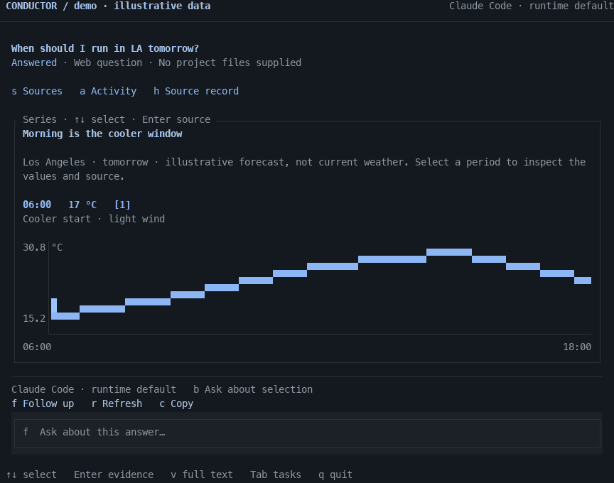

# Conductor

**An agent workspace in your terminal.**

Ask questions, explore structured results, and review code changes with their
evidence. Built in Rust. Runs standalone or inside [Herdr](https://github.com/herdrdev/herdr).



*Actual terminal renderer, illustrative demo data. No model calls. [Still view](docs/screenshots/workbench-series.png).*

- **Useful results:** Markdown, tables, charts, choices, diffs, and test reports.
- **Context that stays:** follow-ups, saved answers, sources, and activity in one task.
- **Recorded checks:** coding workflows produce receipts showing what passed, failed, or was not checked.
- **Local tools:** inspect Git changes and render reports without a model call.

## Install and try

Requires Git and a current stable Rust toolchain.

```sh
git clone https://github.com/ashark-ai-05/conductor.git
cd conductor
cargo install --locked --path .
conductor ui --demo
```

The demo needs no account. Press **Tab** to explore sample tasks, **Enter** to
inspect a selection, and **Esc** to return.

## Run Conductor

From your project directory, choose an authenticated CLI installed on `PATH`:

```sh
conductor ui --ask                     # Claude, with web tools
conductor ui --ask --agent copilot     # GitHub Copilot CLI
conductor ui --ask --agent amp         # Amp
conductor ui --ask --agent pi          # Pi
conductor ui --tasks                   # Return to saved tasks
```

Try: **“Compare exponential backoff and fixed retries in a table.”**

**F3** chooses an agent and model before starting; Amp uses a mode instead.
**f** follows up, **s** opens sources, **a** opens activity, and **h** opens the
source record or workflow receipt. **Ctrl+K** opens local actions.

**Early release:** Copilot, Amp, and Pi question adapters are experimental and run
without tools, live web access, or repository editing. Coding workflows currently
use Claude, scripts, and human review. Citations are not independently verified;
workflow receipts cover the configured checks. [Adapter setup and limits →](docs/agent-workbench.md)

## Inside Herdr

With Herdr 0.9.1+ installed, run from this checkout in a Herdr session:

```sh
cargo build --release --locked
herdr plugin link "$PWD"
```

Open **Ask Conductor** from Herdr's plugin menu. Rebuild after updating the
checkout; the plugin uses `target/release/conductor`.

<details>
<summary><strong>Run a coding workflow</strong></summary>

From the target Git repository:

```sh
conductor init
$EDITOR .conductor/task.md
git add .conductor .gitignore
git commit -m "Configure Conductor"
conductor doctor
conductor run .conductor/workflows/build.yaml --spec .conductor/task.md
```

Review the generated workflow and install the prerequisites reported by `doctor`.
Workflow definitions are read from the starting commit. After a run, use
`conductor receipt <run>` to read its checks or `conductor verify <run>` to verify
record integrity. See the [bug-fix example](examples/sdlc-mock/README.md).

</details>

[Workspace guide](docs/agent-workbench.md) ·
[Local reports](docs/native-capabilities.md) ·
[Design study](docs/design/agent-workbench/README.md) ·
[Animation source](docs/media/README.md)
