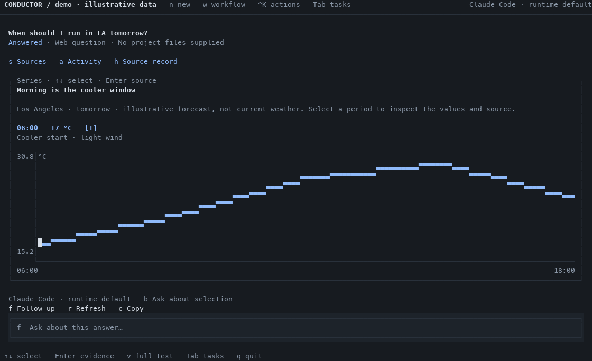
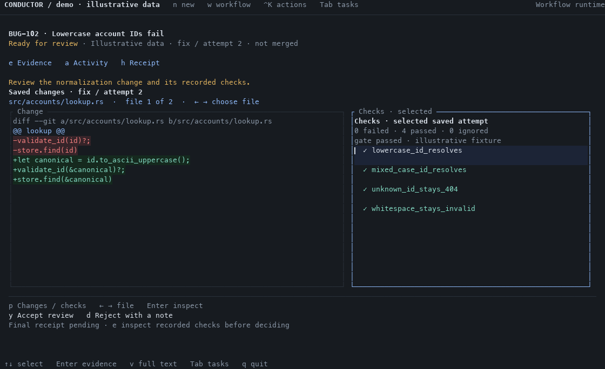

# Agent workbench: first implementation

Implemented after approval on 2026-10-01. The [design study](design/agent-workbench/README.md)
remains the broader direction; its mockup is not a statement of shipped adapter support.

## Try it

From this checkout:

```sh
cargo build --release --locked
target/release/conductor ui --demo
```

`Tab` opens the sample task drawer. Try **When should I run in LA tomorrow?** for a
selectable chart, **BUG-102** for changes and checks, and the FDE clarification.
All demo values are fixtures. No agent runs and no real review is recorded.

For real questions:

```sh
target/release/conductor ui --ask
target/release/conductor ui --ask --agent copilot
target/release/conductor ui --ask --agent amp
target/release/conductor ui --ask --agent claude --model sonnet
target/release/conductor ui --ask --agent pi --model <provider/model>
```

Replace `<provider/model>` with an ID supported by your authenticated Pi installation.
On the new-question screen, `F3` opens the agent/model picker: arrows choose an agent,
Tab edits the optional model ID (or Amp mode), Enter applies, and Escape discards the edit. The
request draft stays intact. Blank model means the runtime default; the picker is
not a live model catalog. Finding a CLI does not establish authentication.

For Copilot, optionally add `--model <model-id>` using an ID available to your
account. For Amp, leave the mode blank initially, or use `--agent-mode <mode>` with
a mode supported by your installed `amp --help`. Amp controls model routing; an
Amp mode is not a model ID. Conductor rejects `--agent amp --model ...`.

Try: **"Compare exponential backoff and fixed retries in a table."** Then `f` to
ask for an example, `a` for activity, or `h` for the source record. A pasted bug
report can be discussed, but these adapters do not read the repository, edit code,
or query Jira. Use Claude for current web questions in this version.

Inside Herdr, rebuild the same release binary used by the linked plugin, then open
**Ask Conductor**. Conductor fills its assigned pane; Herdr retains the outer
navigation. Existing workflow configuration chooses coding-stage agents separately.

## Implemented views

These images render the actual Rust/Ratatui cell buffers with a monospace font.
They use illustrative demo data, not live agent output, and omit Herdr's outer chrome.





Also inspect the [narrow pane](screenshots/workbench-narrow.png),
[agent picker](screenshots/workbench-picker.png), and [light theme](screenshots/workbench-light.png).

Generate a cell snapshot with
`cargo run -p conductor-tui --example workspace -- 140 38 series --json`.
Replace `series` with `bug`; add `light` for the light palette.

## Runtime boundaries

| Adapter | Available in this implementation | Limits |
|---|---|---|
| Claude Code | Existing web question runner, model override, follow-ups, clarification, captures and activity | Authenticated Claude CLI required; existing safe-mode restrictions retained |
| Pi (experimental) | One-shot JSON question runner, runtime model/provider selection, structured results, clarification and usage | Tools and discovered resources disabled; no live web lookup, repository editing, extension dialogs, or coding workflow stages |
| GitHub Copilot (experimental) | JSONL question runner, model selection, structured results, clarification and usage | Copilot CLI access must be enabled for the account/organization; no tools or live sources; billing multiplier is not displayed as dollars |
| Amp (experimental) | Streaming JSON question runner, optional Amp mode, structured results, clarification and usage | Tools disabled through scratch workspace settings; IDE context disabled; no tools or live sources; no model ID override |
| Native operations | Local Git/report captures and refresh | No model involved |

The Pi adapter follows the documented [JSON event stream](https://github.com/earendil-works/pi/blob/main/packages/coding-agent/docs/json.md)
and [CLI resource controls](https://github.com/earendil-works/pi/blob/main/packages/coding-agent/docs/cli.md).
It requires a CLI supporting the flags in `question_agent::pi_argv`. It does not
use a persistent RPC session. A clean process exit and completion event are required;
provider failures and interrupted streams remain stopped tasks.

Copilot uses its [programmatic interface](https://docs.github.com/en/copilot/reference/copilot-cli-reference/cli-programmatic-reference)
and [session event schema](https://github.com/github/copilot-sdk/blob/main/nodejs/src/generated/session-events.ts).
Amp uses [streaming JSON](https://ampcode.com/docs/cli/streaming-json) and
[workspace tool settings](https://ampcode.com/docs/cli/settings). The adapters require
completion events and a clean exit. Unexpected tool exposure or execution stops the
Copilot/Amp question. User and organization runtime policies still apply.

Credentials remain with the selected CLI. For testing or an alternate executable,
`CONDUCTOR_CLAUDE_BIN`, `CONDUCTOR_PI_BIN`, `CONDUCTOR_COPILOT_BIN`, and
`CONDUCTOR_AMP_BIN` override the respective program. Copilot/Amp may also save their
own sessions under their runtime's storage and retention settings.
Question turns run in an empty temporary directory. Conductor stores history and
re-supplies it on each turn; it does not claim to resume a runtime's hidden state.

The selected agent/model or Amp mode is saved with the task. Follow-ups, clarification replies,
and retries retain it. Old question records default to Claude. Changing a runtime
requires a new question; cross-agent handoff is not implemented.

## Result and inspection controls

| Key | Action |
|---|---|
| `n` / `w` | New question / existing workflow |
| `F3` | Choose the agent/model on a new question |
| `↑` / `↓`, `Enter` | Select a fact, table row, chart point or check; inspect its supporting record |
| `s` / `e` | Question sources / workflow evidence |
| `a` | Recorded activity |
| `h` | Source record, native capture record, or workflow receipt |
| `b` | Put the selected question result/source into an editable follow-up |
| `f` | Follow up; unsent drafts survive inspection and task switching within this UI session |
| `p`, `←` / `→` | Switch changes/checks in a narrow pane; choose a saved file |
| `v` | Full text or original Markdown |
| `y` / `d` | Existing review acceptance/rejection or tool permission, with the existing note flow |
| `Esc` | Return from inspection without resetting result selection |

The header shows intent and state; the inspector opens beside the result when there
is room and replaces it in a narrow pane. The composer stays near the bottom. The
agent/model label records the requested selection, not a claim that authentication
or a particular model call succeeded.

## Widgets and evidence

Markdown, facts, tables, choices, diffs, and tests retain their existing contracts.
A question can now return a `series` presentation containing a title, summary,
unit, and 2–200 ordered points. Each point carries a label, finite numeric value,
detail, and citation references. The chart treats points as ordered categories,
not a true elapsed-time axis; select a point to read its exact value and source.

Validation rejects unknown fields, invalid references, oversized text, and invalid
numbers. Invalid presentations retain the full answer. Malformed JSON responses
remain readable as text. Agents cannot create commands, controls, or trusted check
verdicts through presentation data. Selection, rendering, and inspection are local.

The source record distinguishes citations from matched tool captures and discloses
that factual accuracy is not independently checked. Pi, Copilot, and Amp supply no captured web
evidence in this mode. Provider-generated capture metadata is discarded.

The workflow receipt inspector reads the existing receipt with its checks, gaps,
execution metadata, and integrity identifiers. It does not run verification or
promote a pending review into a completed receipt. Opened records retain their
snapshot while newer work arrives. Use `conductor verify <run>` for a fresh integrity
check. The independent check engine and review semantics are unchanged.

## Validation and remaining work

Automated coverage includes all four CLI contracts using isolated fakes, persistent
agent selection, stale/duplicate clarification replies, cancellation, incomplete
streams, errors, capture provenance, invalid series data, draft preservation,
receipt snapshots, and wide/narrow/tiny layouts. These tests make no model calls.
Pi was not installed on the development machine; a live authenticated Pi run is
still required before calling the adapter production-ready.

Live checks on 2026-10-01 found Copilot CLI 1.0.85 installed, but its test request
returned **Access denied by policy settings**. Use an account where CLI access is
allowed; check your organization's Copilot administrator or
[Copilot settings](https://github.com/settings/copilot). No policy was changed.
The local Amp binary stalled even on `--help`/`--version`; those diagnostic
processes were stopped. Confirm `amp --help` and a small `amp -x` question work in
your terminal before testing through Conductor. Successful live Copilot/Amp
answers remain unverified; integration tests use controlled CLI fixtures.

The renderer example can measure local drawing separately from agent latency:

```sh
cargo run --release -p conductor-tui --example workspace -- 140 38 series --bench
```

It measures 100 frames after warmup through Ratatui's test backend. It excludes
terminal I/O, task loading, and agent execution. The design's end-to-end latency
targets remain unverified. Idle demo frames no longer redraw continuously.

Not implemented in this slice: Codex/ACP adapters, direct model API execution,
Pi/Copilot/Amp tool execution and coding stages, Pi RPC interaction, cross-agent handoff, arbitrary generated UI, multi-artifact
composition, production replay, mouse controls, and new Jira/QA/ops executors.
