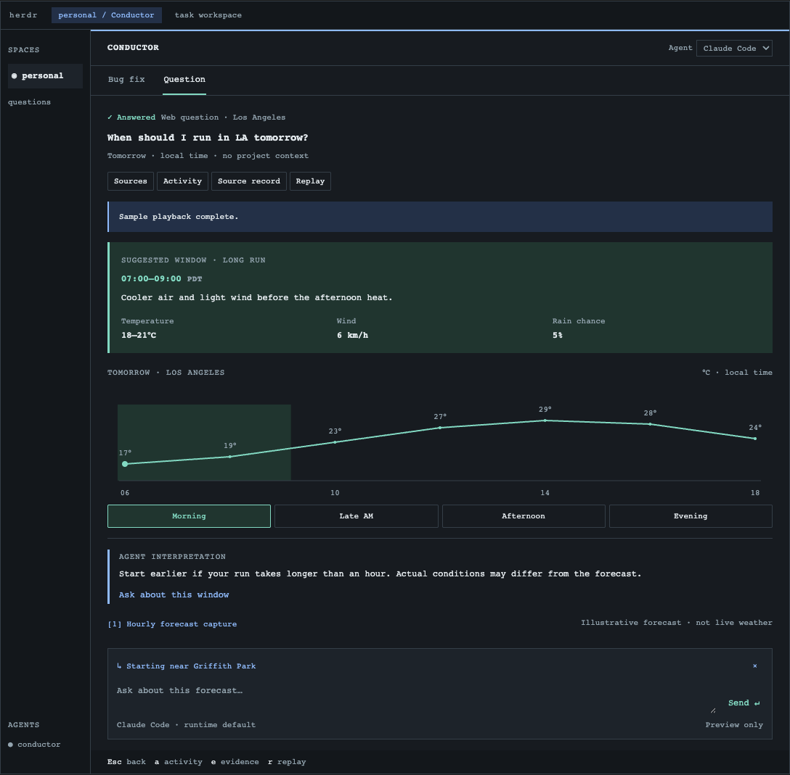
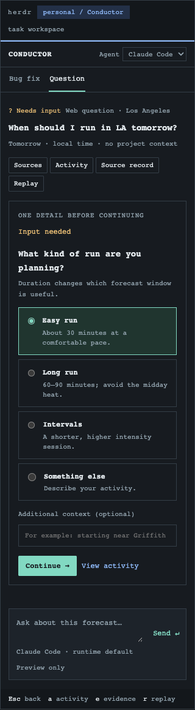
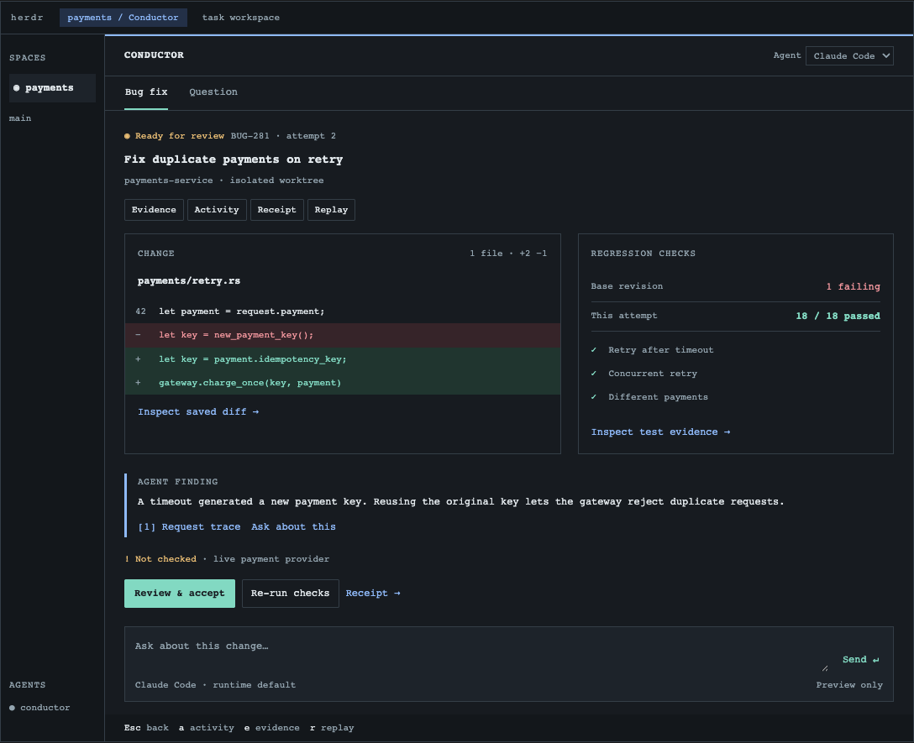
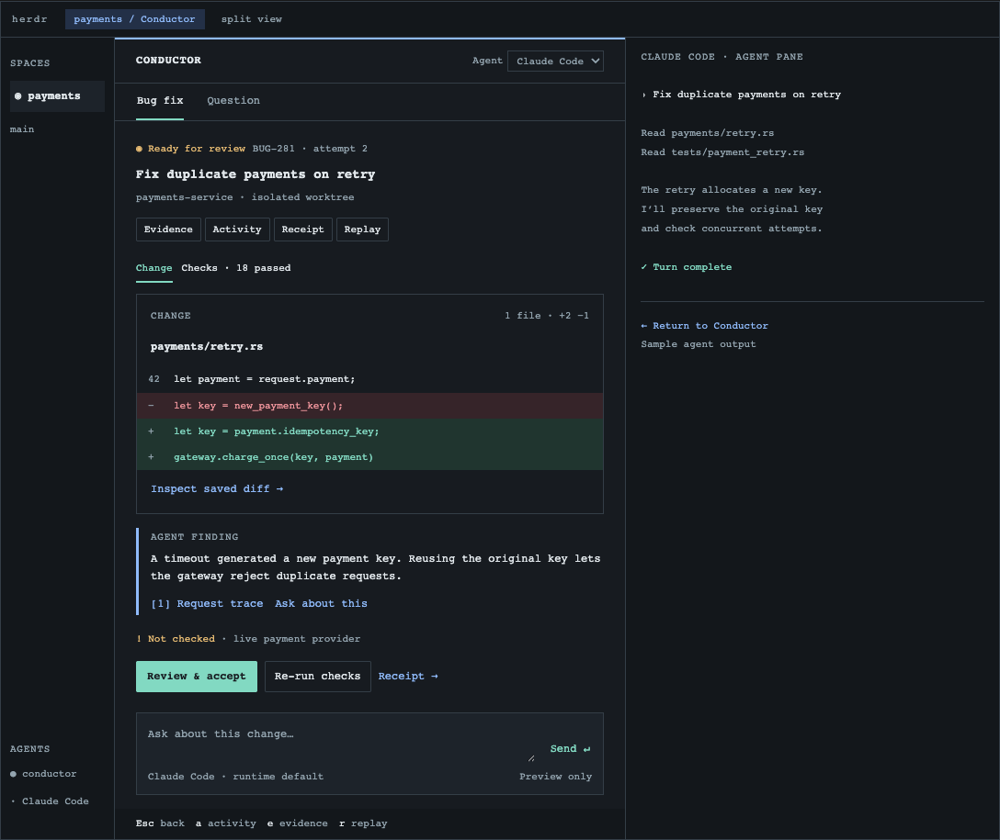
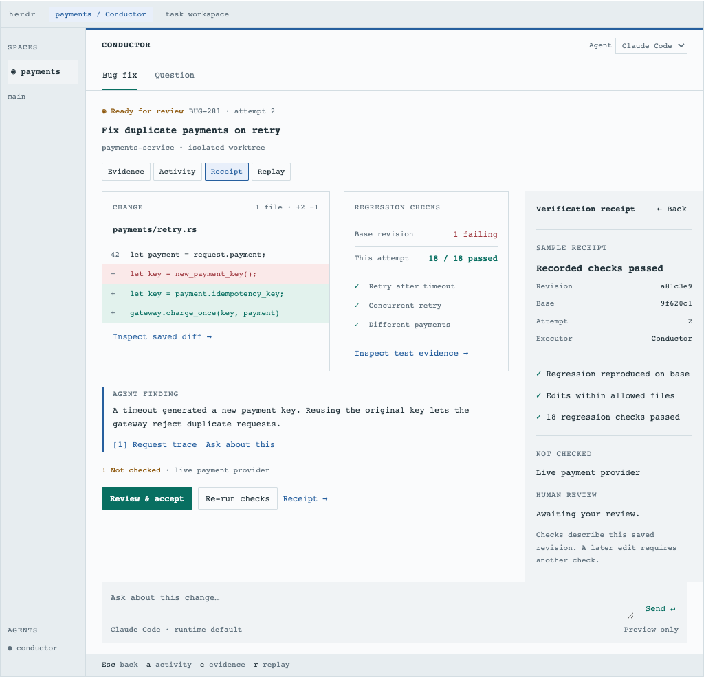

# Agent workbench design

**Status: proposal, 2026-10-01. Implementation awaits explicit confirmation.**
This directory records a product direction and an interactive design study. It
does not add agent adapters, change Conductor's runtime, or supersede the current
scope in `CLAUDE.md`. All screenshots show a browser mockup with illustrative data,
not the running Rust TUI. See the [root README](../../../README.md) for shipped
capabilities.

Conductor should be a rich workspace for working with agents: ask freely, inspect
useful results, act on them, and trace decisions back to evidence. The main screen
should answer three questions: **What happened? What needs me? What supports it?**

## Explore the design

Open [prototype.html](prototype.html) locally in a current browser. GitHub shows
HTML source rather than running it; clone or download the file first. On macOS,
from the repository root:

```sh
open docs/design/agent-workbench/prototype.html
```

No server, build, account, or API key is required. The preview makes no agent or
model calls. It includes its display runtime and sample data; it is not a new web
frontend for Conductor. [prototype.fragment.html](prototype.fragment.html) is the
editable design source; `prototype.html` is its standalone export. The exported
wrapper uses text navigation arrows and omits optional CDN libraries, so all
preview interactions work offline.

Try these paths:

1. **Bug fix:** inspect the diff and test evidence, attach a test to the composer,
   then choose **Review & accept** and enter a review note.
2. **Replay → A check caught a bug:** inspect the failed attempt and select
   **Retry fix**. The transition is simulated; no tests or commands run.
3. **Question:** select a time window, inspect its forecast capture, then use
   **Replay → A question for you** to try a choice or custom answer.
4. Use the layout carousel to compare **Full workspace** with **Herdr split**.
   Narrow the browser to see the inspector replace the result. The preview
   follows the browser's light or dark appearance.

The agent picker changes a label only. Follow-up messages stay inside the mockup.
Replay selects editable sample states for design exploration; production replay
must be read-only. Forecasts, code, logs, revisions, outcomes, and timings are
fixtures and must not be presented as real evidence.

## Why change the experience?

The current screenshots exposed three problems: long answers look like terminal
transcripts, activity competes with the result, and questions requiring a choice
can arrive as prose. A larger widget catalog alone will not solve this. Conductor
needs a clear interaction contract and a consistent hierarchy.

Keep the result dominant. Use a document when prose is appropriate, a choice when
input is needed, and a diff with checks when reviewing a change. Opening evidence
should explain the selected item, not force the user to search an unrelated log.

The compelling moment is a complete useful loop: a failed check points to the
relevant change, the user can ask about that exact evidence, and the eventual
review records what was and was not checked. Attractive panels support this loop;
extra counters, animation, or an infinite canvas do not establish utility.

## One shell, different results

| Region | Responsibility |
|---|---|
| Task header | Intent, current state, workspace scope, active agent; model only when known and selectable |
| Main result | The answer, artifact, decision, or failure that matters now |
| Inspector | Selected evidence, sources, activity, receipt, or history; opened on demand |
| Composer | Follow-up in the same task, with visible attachments from selected artifacts |
| Local actions | Controls valid for the selected artifact and current task state |

The mockup's **Bug fix / Question** tabs select two examples. They are not a
proposed restriction on task types. Users start with a request and optional
context, without selecting a rigid workflow first. Saved workflows remain useful
for repeatable execution and required checks.

Herdr owns spaces, tabs, and terminal panes. Conductor owns task state, results,
evidence, and decisions. The outer Herdr chrome in the mockup supplies context;
Conductor must not render a second Herdr sidebar inside its pane. Standalone mode
uses the same task surface with its own compact task switcher.

Layout responds to usable terminal columns. A wide pane can place diff and checks
side by side; a narrow pane uses **Change / Checks** tabs. An inspector replaces
the result when both cannot remain readable, with one action to return. Closing
it restores selection and scroll. Do not shrink text or force wide dashboards
into a split pane. Browser pixels in this study are not terminal breakpoints.

### Ad hoc question

Example: **“When should I run in LA tomorrow?”**

- If needed, show a focused clarification with choices, a custom answer, and
  optional context. Submit it to the same pending request and task.
- While working, show a short status and real recorded activity. Do not invent
  percent complete or reveal hidden model reasoning.
- Put the recommended window first, followed by the relevant forecast. Selecting
  another window changes the displayed details locally, without calling a model.
- Open a source at its captured observation, including origin, retrieval time,
  and limitations. If retrieval failed, show that failure rather than sample or
  previously captured values masquerading as fresh data.
- Follow-ups retain the task and selected context. Preserve earlier answers and
  captures instead of silently replacing their history.

A simple “What is the weather in LA?” can be a compact conditions summary; it
does not need an itinerary or clarification. A conceptual question can remain a
well-rendered Markdown document. Use only structures that help the actual request.


*Proposed question surface — illustrative forecast, not current weather.*


*Proposed clarification — choices remain actionable at a narrow width.*

### Bug fix

Example: **“Fix BUG-281: duplicate payments on retry.”**

1. Establish ticket context, repository scope, acceptance criteria, and available
   tools. A future Jira adapter should capture the issue and its version; without
   access, accept pasted text or a local file and state that limitation.
2. Investigate and reproduce. Show evidence as it arrives, distinguishing the
   agent's finding from a recorded failing test.
3. Make the change in an isolated worktree using the existing execution engine.
   Show the saved diff and checks against the precise attempt being reviewed.
4. If a check fails, lead with the failed assertion and affected change. Keep
   passing checks visible, retain the attempt, and offer a permitted retry or
   user intervention. A retry is a new attempt, not an overwritten success badge.
5. When ready, show the change, regression results, gaps, and **Review & accept**.
   Record the person's note against the inspected revision. Any later edit makes
   earlier check coverage visibly stale.

Review acceptance does not itself deploy, merge, or publish. Those are separate
capabilities with their own execution and permission boundaries.


*Proposed review surface — sample diff, regression results, and an explicit gap.*


*Proposed Herdr integration — result on the left; illustrative agent output on the right.*

## Sources, activity, and receipts

Sources answer “Where did this come from?” Activity answers “What happened?” A
receipt answers “What was checked, against what, and what remains unknown?” Keep
these meanings distinct even when they share an inspector.

| Evidence state | Meaning in the interface |
|---|---|
| Agent statement | A conclusion supplied by an agent; not an independent check |
| Captured output | Saved tool output or source content with origin and time |
| Independently checked | A Conductor-run check, its definition, result, and exact input/revision |
| Human accepted | Who reviewed which revision, when, and their note |
| Unknown / not checked | Missing capture, unsupported check, stale evidence, or excluded scope |

A citation or successful fetch does not verify a claim. Record integrity does not
prove factual correctness. A passing test covers its assertion and environment,
not every possible deployment. Generated content cannot assign itself a trusted
verdict or grant permission to an action.

Activity should group meaningful operations, such as a search and its captures
or a test command and its result. Show actor, state, and elapsed time; expand to
raw output and absolute timestamps. Avoid repeated “preparing answer” noise.

Receipts should expose revision, attempt, checks, evidence links, human decision,
and gaps. Pending, stopped, and failed work must remain distinguishable from a
completed receipt. Reopening a task must reconstruct its recorded state. In the
future production history view, actions must be disabled or explicitly return to
the current task; viewing history must never rerun an operation.


*Proposed receipt — sample revision and checks; unchecked scope stays visible.*

## Dynamic content, deterministic rendering

Agents describe content and intent. Conductor validates that data and renders
known Rust components. Resizing, selecting, sorting, expanding, navigating
history, and opening saved evidence run locally, without model calls.

Start with reusable primitives: Markdown/code documents, facts, tables, diffs,
test results, simple series charts, choices/forms, activity, and evidence links.
Compose these around artifacts rather than maintaining a widget for every job
title. A weather result and an ops measurement can reuse facts and series; a QA
report and bug fix can reuse test results; a BA decision can reuse documents,
comparisons, and choices.

The component catalog constrains presentation, not what users may ask. Discover
available actions from configured adapters and project capabilities. Validate
input schemas, context, permissions, and current state before enabling them.
Never treat generated labels, Markdown, or source content as executable actions.
Unknown artifact types fall back to a readable document or literal data viewer.
Extensions can add reviewed components later; arbitrary generated Rust or UI
code is outside this proposal's first implementation.

A future event contract should carry stable task, session, attempt, artifact, and
request IDs; ordered events; artifact versions; origin; and evidence references.
Bind input responses and actions to their originating request and version.
Duplicate or late events must not resubmit an action, overwrite a newer result,
or apply a clarification to another session. Adapters normalize events; the
existing check engine remains responsible for independent verification.

Updates must preserve selection, scroll position, and unsent text. Do not reorder
panels under the user. Show an update indicator if the inspected artifact changes.
If structured output is invalid, keep the readable response and expose the
presentation error without inventing controls or a verified result.

## Agents and models are different integration paths

An agent runtime brings its own context, tools, authentication, approvals, and
session lifecycle. A raw model endpoint supplies inference; someone still has to
own the tool loop, permissions, persistence, cancellation, and recovery.

| Path | Proposed approach | Constraint |
|---|---|---|
| Claude Code | Adapt existing integration to shared task events | Preserve existing permission and evidence behavior |
| Pi | Evaluate RPC as the second adapter and a route to multiple model providers | Only expose supported RPC interactions; do not assume arbitrary extension UI works remotely |
| Codex | Evaluate App Server session and approval events | Pin and test protocol versions; documentation marks the command experimental |
| Amp | Evaluate SDK streaming and thread support | Negotiate actual capabilities rather than assuming parity |
| ACP | Use where an agent implements required protocol capabilities | A shared protocol does not mean every agent supports every interaction |
| Direct model APIs | Later adapter or existing agent harness with provider support | Requires a tool-execution owner; a model selector alone is insufficient |

The first implementation candidate is existing Claude plus Pi, subject to an
adapter feasibility check. Treat OpenRouter, Anthropic, and OpenAI model choices
as capabilities advertised by the selected runtime/provider. The preview only
shows agent names; a real model menu and its capability/error states still need
design validation.

Switching agents should create an explicit handoff with selected task context,
artifacts, and permitted evidence. Do not imply invisible transfer of private
runtime state or a conversation's full hidden context. Keep the original session
inspectable. Unsupported controls should explain their limitation.

## Rust, speed, and visual quality

Retain Ratatui and the existing Rust engine. Use terminal-native layout, text
styles, tables, lists, charts, and custom widgets where necessary. The HTML study
expresses hierarchy and behavior; it does not promise browser typography,
rounded controls, or graphics support in every terminal.

Keep keyboard actions first-class, with mouse interaction where supported.
Respect Herdr shortcuts, display local key hints, preserve focus, pair color with
text, and provide plain-text/source views. Validate dark/light contrast, Unicode
width, long content, and small panes in actual terminals before calling the
implementation finished.

Proposed performance targets, **not measured results**:

- Local input-to-render latency below 50 ms at p95 on a documented reference setup.
- Open an already saved task within 200 ms for a documented fixture size.
- No model or network dependency for local inspection and layout changes.

Use bounded event processing, incremental updates, cached parsed documents and
layouts, and viewport rendering for large outputs. Keep agent latency separate
from UI latency. A browser mockup cannot validate these Rust performance goals.

## Validation and implementation boundary

Before implementation approval, review both examples in clarification, working,
failure, and complete states, in full and split panes. The narrow custom input,
failed-source state, and revision-specific review are essential, not polish to
add after the happy path.

After separate confirmation, a proposed sequence is:

1. Define the shared event, artifact, action, and input contracts; validate the
   second adapter against real streams and existing permission behavior.
2. Deliver one complete question and one complete bug-fix path using reusable
   widgets and the existing check engine.
3. Validate cancellation, disconnect/reconnect, stale evidence, reopening saved
   work, late replies, malformed data, and unsupported agent features.
4. Test actual Herdr and standalone layouts, keyboard navigation, large output,
   and the stated latency targets. Only then broaden adapters and workflows.

Success means a user can answer or review from the task surface, open supporting
evidence in one step, recover from a failed attempt, and identify what remains
unchecked without reading raw logs. Test the same interaction with two real
agents; do not measure universality by the number of names in a picker.

For a public demo, show a real bug reproduced, fixed, checked, and reviewed in one
short recording, followed by a different question rendered appropriately. Supply
an offline demo and easy installation. Label fixture footage; never present this
prototype as shipped behavior. Sharing a reviewed, redacted replay could follow
later. Virality is a distribution hypothesis; repeat use and completed tasks are
stronger product signals than stars alone.

Open decisions: the second adapter after feasibility testing; model-picker and
handoff behavior; the exact event/action schema; terminal column thresholds and
keys; and limits for large artifacts. This document records a direction and does
not authorize those changes.

## Technical references

Research references for this proposal, reviewed 2026-10-01. These identify
integration surfaces to evaluate, not integrations shipped by Conductor.

- [Claude Code programmatic execution](https://code.claude.com/docs/en/headless)
- [Pi RPC](https://github.com/earendil-works/pi/blob/main/packages/coding-agent/docs/rpc.md), [RPC extension UI](https://github.com/earendil-works/pi/blob/main/packages/coding-agent/docs/rpc-extension-ui.md), and [providers](https://github.com/earendil-works/pi/blob/main/packages/coding-agent/docs/providers.md)
- [Codex App Server](https://learn.chatgpt.com/docs/app-server)
- [Amp SDK](https://ampcode.com/docs/sdk)
- [ACP initialization and capability negotiation](https://agentclientprotocol.com/protocol/v1/initialization)
- [OpenRouter tool calling](https://openrouter.ai/docs/guides/features/tool-calling)
- [A2UI declarative UI](https://github.com/a2ui-project/a2ui), an architectural reference rather than a selected dependency
- [Ratatui widgets](https://ratatui.rs/concepts/widgets/) and [rendering](https://ratatui.rs/concepts/rendering/under-the-hood/)
